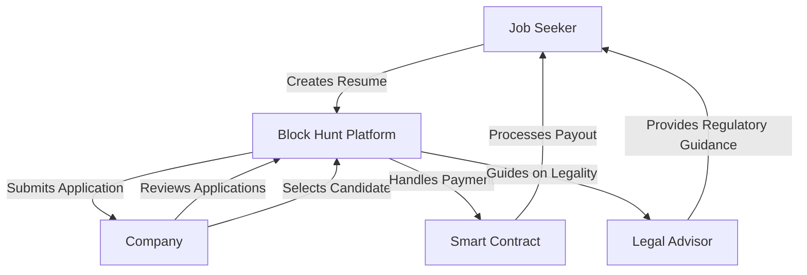

# Block Hunt

Block Hunt is a Web3 platform connecting job seekers with blockchain companies. We simplify hiring and empower individuals to explore decentralized work opportunities, bridging the gap between Web2 and Web3 systems. This platform is specifically tailored for the Indian community, with a strong emphasis on educating users about government regulations and legal aspects of the Web3 industry.

## Technical Overview

### Architecture

## Challenges Addressed

The Web3 ecosystem is rich with opportunities often underutilized due to technical complexities, confusing payout processes, and regulatory uncertainties. Block Hunt aims to:

| Challenge                | Solution                                                                                         |
|--------------------------|--------------------------------------------------------------------------------------------------|
| Fragmented Opportunities | **Centralized Platform**: Aggregates jobs, freelance gigs, and grants in one place.              |
| Complex Payouts          | **Simplified Withdrawals**: Streamlines payout processes and clarifies regulations.              |
| Lack of Awareness        | **Education and Legal Guidance**: Offers expert advice on payments, withdrawals, and compliance. |

## Project Features

### For Companies

* **Decentralized Job Posting**: Manage interns and job listings within the Base Community.
* **Payment Handling**: Process payments directly on the platform.
* **Candidate Selection**: Streamlined selection process using decentralized technology.

### For Job Seekers

* **Resume Creation**: Generate and manage resumes for multiple job applications.
* **Application Management**: Apply effortlessly with a single click.
* **Web2 to Web3 Bridge**: Smooth onboarding through SmartWallet and Basenames.
* **Legal and Regulatory Guidance**: Access to expert guidance on government regulations, crypto payments, and withdrawal processes.